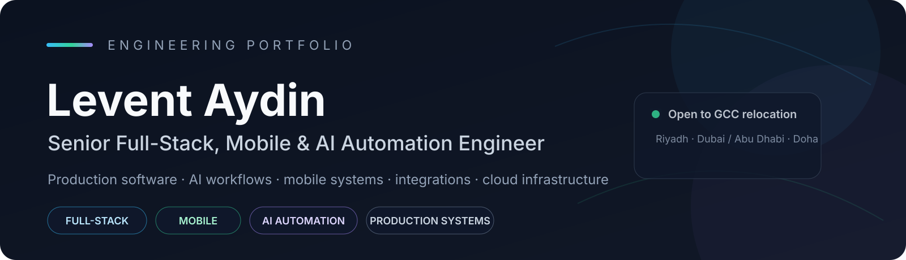

[Email](mailto:leventaydin0107@gmail.com) · [GitHub](https://github.com/LEVENT-AY)

---

## Engineering Profile

I build and operate production software end to end — from mobile products and backend APIs to data models, AI-assisted workflows, third-party integrations, deployment, and production troubleshooting.

My background combines **12+ years of hands-on product and software delivery** with experience across customer-facing applications, automation, operational systems, and infrastructure. I am most effective in roles where engineering ownership goes beyond one layer of the stack.

**Target roles:** Senior Full-Stack Engineer · Product Engineer · Mobile / Flutter Lead · AI Automation Engineer · Solutions Engineer · Technical Lead

### Recruiter start here

| Hiring for | Best starting points |
|---|---|
| **Full-Stack / AI Automation** | [FB Groups](https://github.com/LEVENT-AY/fb-groups-case-study) · [Souketwensa CRM](https://github.com/LEVENT-AY/souketwensa-crm-case-study) |
| **Mobile / Flutter / Realtime** | [Kovoyo](https://github.com/LEVENT-AY/kovoyo-case-study) · [Dalilk in Turkey](https://github.com/LEVENT-AY/dalilk-in-turkey-case-study) |
| **Platform / Backend / Infrastructure** | [Aya Cloud](https://github.com/LEVENT-AY/aya-cloud-case-study) · [Trendyol Syria](https://github.com/LEVENT-AY/trendyol-syria-case-study) |

## Core Engineering

| Area | Working stack |
|---|---|
| **Mobile & Product** | Flutter, Dart, Android/iOS workflows, realtime applications, maps & routing |
| **Backend** | Node.js, TypeScript, Express, tRPC, NestJS, Fastify, REST APIs, webhooks |
| **Data** | PostgreSQL, PostGIS, MySQL, Firebase, Supabase, Redis, OpenSearch |
| **AI & Automation** | LLM-assisted workflows, AI workers, operational orchestration, automation systems |
| **Integrations** | Meta Graph API, Messenger, WhatsApp-oriented workflows, third-party APIs |
| **Infrastructure** | Docker, Docker Compose, Linux/WSL, Cloudflare, Nginx, CI/CD, monitoring |

## Featured Engineering Portfolio

<table>
<tr>
<td width="50%" valign="top">

### FB Groups
**AI Moderation & Market Intelligence Platform**

Chrome MV3 automation, backend/API, AI worker, dashboard, PostgreSQL state, guarded execution, and production-safe delivery workflows.

**Focus:** AI · Browser Automation · Node.js · PostgreSQL · CI/CD

[Open showcase →](https://github.com/LEVENT-AY/fb-groups-case-study)

</td>
<td width="50%" valign="top">

### Souketwensa CRM
**Omnichannel CRM & AI Operations Platform**

Multi-tenant CRM integrating Meta messaging workflows, customer operations, APIs, AI-assisted response flows, and production delivery.

**Focus:** React · Node.js · Meta APIs · CRM · AI Automation

[Open showcase →](https://github.com/LEVENT-AY/souketwensa-crm-case-study)

</td>
</tr>
<tr>
<td width="50%" valign="top">

### Aya Cloud
**VPS, Hosting & Customer Operations Platform**

Hosting-oriented customer platform with service quotas, domain workflows, Docker/Linux operations, orchestration boundaries, Cloudflare routing, and health-focused operations.

**Focus:** Next.js · Docker · Linux · PostgreSQL · Cloudflare

[Open showcase →](https://github.com/LEVENT-AY/aya-cloud-case-study)

</td>
<td width="50%" valign="top">

### Kovoyo
**Realtime Shared-Mobility Platform**

Multi-app Flutter system for driver, passenger, and operations flows with realtime state, PostgreSQL/PostGIS, route logic, and geo services.

**Focus:** Flutter · Realtime · PostGIS · Mobile Architecture

[Open showcase →](https://github.com/LEVENT-AY/kovoyo-case-study)

</td>
</tr>
<tr>
<td width="50%" valign="top">

### Dalilk in Turkey
**Arabic-First Multi-Service Community Platform**

Flutter/Firebase product spanning service requests, jobs, transport, directories, community flows, moderation, and a web administration system.

**Focus:** Flutter · Firebase · Admin Systems · Product Engineering

[Open showcase →](https://github.com/LEVENT-AY/dalilk-in-turkey-case-study)

</td>
<td width="50%" valign="top">

### Trendyol Syria
**Arabic Commerce & Catalog Platform**

Performance-first commerce architecture with catalog ingestion, canonical PostgreSQL data, Redis projections, OpenSearch indexing, and event-driven reliability.

**Focus:** Node.js · PostgreSQL · Redis · OpenSearch · Commerce

[Open showcase →](https://github.com/LEVENT-AY/trendyol-syria-case-study)

</td>
</tr>
</table>

## Engineering Approach

- **Own the full lifecycle.** I am comfortable moving from product requirements to architecture, implementation, deployment, and production debugging.
- **Design for failure.** External APIs, webhooks, asynchronous jobs, browser automation, and deployments need retries, reconciliation, health evidence, and recovery paths.
- **Separate truth domains.** Source code, runtime state, external-platform behavior, and production health are different facts and should be verified independently.
- **Optimize the right boundary.** Canonical data, read models, mobile UX, integration layers, AI workers, and infrastructure each have different correctness and performance requirements.
- **Prefer evidence over assumptions.** Production behavior, physical-device validation, health checks, and reproducible verification matter more than a build that merely completes.
- **Keep systems understandable.** Clear boundaries, explicit operational rules, and focused documentation reduce the cost of change.

## Private Source, Public Engineering Evidence

Several of my strongest systems are commercial or operational products. Their source repositories remain private to protect customer data, credentials, infrastructure details, and intellectual property.

The public showcases above document architecture, engineering decisions, technology choices, product scope, and production concerns **without publishing proprietary source code**.

## Languages & Mobility

**Arabic:** Native · **English:** Working professional · **Turkish:** Conversational · **German:** Basic

Based in Türkiye and open to on-site or hybrid opportunities across the GCC, especially **Riyadh, Dubai / Abu Dhabi, and Doha**.

---

**Building production systems that connect product, software, automation, and operations.**

