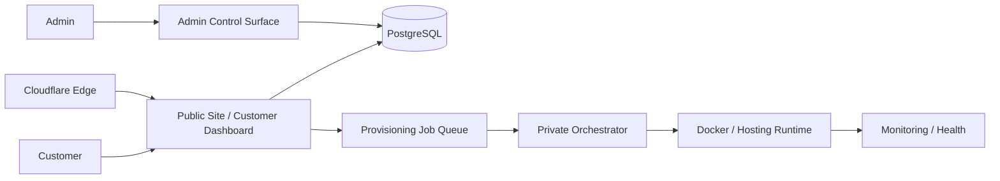

# Aya Cloud — VPS & Hosting Operations Platform

> **Private commercial infrastructure — architecture case study only. Credentials, private hostnames, provisioning details, and customer data are intentionally omitted.**

## Overview

Aya Cloud is a hosting-oriented customer and operations platform designed around a clear separation between public product UX, customer self-service, background provisioning, and private infrastructure tooling.

The goal is broader than deploying a website: customers need a coherent control surface for subscriptions, service status, domains, sites, quotas, and future hosting operations, while the infrastructure layer needs safe provisioning boundaries, observability, routing, and reproducible operations.

## My role

I worked across product architecture, Next.js application delivery, customer/admin dashboards, database-backed subscription and quota models, Dockerized infrastructure, Linux/WSL operations, Cloudflare routing, monitoring, deployment workflows, and the foundation for asynchronous provisioning.

## Architecture

## Engineering highlights

- Next.js App Router application with React and TypeScript.
- Real authentication and database-backed customer models.
- Hosting-style customer dashboard for service state, quotas, domains, and product operations.
- Secure admin foundation for customer and subscription-plan management.
- Per-customer resource quota and usage models rather than hard-coded plan assumptions.
- Persisted domain-request workflows with controlled admin review.
- Queue-oriented provisioning architecture that keeps Docker access out of the web application.
- Private orchestrator boundary for future VPS/container/site provisioning.
- Docker Compose-based service operations on Linux/WSL.
- Cloudflare Tunnel / edge routing to expose services without directly publishing arbitrary host ports.
- Operational tooling for monitoring, service health, container visibility, and file/status administration kept outside public customer UX.
- Explicit separation between development and production runtimes.
- Health verification and rollback-oriented deployment practices.

## Technology

| Layer | Technology / focus |
|---|---|
| Customer product | Next.js, React, TypeScript |
| Data | PostgreSQL, Prisma |
| Provisioning | Queue-based jobs, private orchestrator boundary |
| Runtime | Docker, Docker Compose, Linux / WSL |
| Edge | Cloudflare Tunnel, private routing |
| Operations | Monitoring, container health, service administration |
| Product model | Subscriptions, quotas, usage, domains, hosting-style controls |

## Engineering decisions

### The web app must not control Docker directly

Customer-facing Next.js code does not receive direct shell or Docker authority. Provisioning intent is persisted as jobs and handled by a separate trusted orchestrator. This keeps the public application boundary narrow and auditable.

### Resource limits belong in data, not UI constants

Plan defaults can seed customer entitlements, but the effective customer quota is stored as its own source of truth and tracked separately from usage. That makes upgrades, overrides, and future provisioning logic much safer.

### Private operations stay private

Monitoring, container administration, status tooling, and file-management surfaces are deliberately separated from customer-facing routes. Infrastructure capabilities should not leak into public product navigation or documentation.

### Production needs more than a running container

Service-health checks, explicit environment separation, controlled ingress, and rollback-minded delivery are treated as part of the product's engineering surface.

## What this project demonstrates

- Hosting / cloud product architecture
- Full-stack customer and admin platform design
- Docker and Linux production operations
- Secure provisioning-boundary design
- PostgreSQL-backed product and entitlement models
- Cloudflare-based edge routing
- Monitoring, health, and deployment thinking
- Ability to connect SaaS UX with real infrastructure concerns

---

**Source availability:** private for commercial, security, and infrastructure reasons. This case study omits credentials, IP addresses, private service URLs, customer data, and proprietary provisioning configuration.
