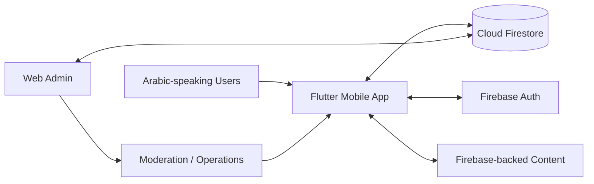

# Dalilk in Turkey — Arabic Community Services Platform

> **Private product code — architecture and product-engineering case study only. Proprietary source, Firebase configuration, customer data, and operational details are not published.**

## Overview

Dalilk in Turkey is an Arabic-first Flutter platform built for Syrians and Arabic-speaking residents in Türkiye. It brings multiple day-to-day service categories into one mobile product rather than treating each need as a separate app.

The product combines user-facing mobile flows with a Firebase-backed data layer and a broad web-admin control surface for reviewing, moderating, and operating the platform.

## My role

I worked across Flutter product development, Firebase/Firestore integration, admin tooling, service workflows, Arabic UX, operational moderation, data integrity, and production troubleshooting.

## Product scope

The platform includes or has implemented operational foundations for areas such as:

- service and consultation requests;
- jobs and job moderation;
- cars and rentals;
- transport / booking workflows;
- doctors, health specialists, pharmacies, and service providers;
- housing / residency-oriented service forms;
- community groups and public chat;
- news and media content;
- kitchen and cleaning services;
- live-camera / discovery experiences;
- support, reports, and admin review workflows.

## Architecture

## Engineering highlights

- Flutter/Dart mobile application with Arabic-first UX.
- Firebase Authentication and Cloud Firestore-backed product state.
- Large multi-domain admin dashboard covering user-generated and operational content.
- Moderation and pending-review flows for jobs, cars, rentals, service requests, and reports.
- Admin visibility across community, healthcare, service-provider, transport, and media domains.
- Public-chat operational tooling and data-repair workflows.
- Arabic text-integrity tooling to detect and repair encoding/mojibake problems before they reach users.
- Product structure designed to support many service categories without requiring separate applications.
- Operational dashboards that distinguish urgent work, pending content, support demand, and platform activity.

## Technology

| Area | Technology / focus |
|---|---|
| Mobile | Flutter, Dart |
| Backend platform | Firebase, Cloud Firestore, Firebase Auth |
| Admin | Flutter web/admin workflows |
| Product | Arabic-first service marketplace / community platform |
| Operations | Moderation queues, support, content review, data repair |
| Quality | Arabic text-integrity checks, production troubleshooting |

## Engineering decisions

### One product, many service domains

Instead of shipping unrelated single-purpose apps, the platform uses shared identity, navigation, data access, moderation patterns, and admin operations across many community-service categories.

### Admin operations are a first-class product surface

User-facing features are only useful if content, requests, providers, and reports can be operated safely. The admin layer therefore has its own workflows, summaries, and review queues rather than being an afterthought.

### Arabic integrity needs technical protection

Arabic UX quality is not only a design concern. Encoding corruption and mojibake can damage production content, so the project includes explicit detection/repair tooling and tests for text integrity.

## What this project demonstrates

- Large Flutter product ownership
- Arabic-first UX and data-quality engineering
- Firebase / Firestore application design
- Multi-domain product architecture
- Admin and moderation-system design
- Community / marketplace workflow engineering
- Ability to operate a product beyond the customer-facing screens

---

**Source availability:** private for IP, customer-data, and operational-security reasons. The case study describes product architecture and engineering scope without exposing proprietary implementation details.
