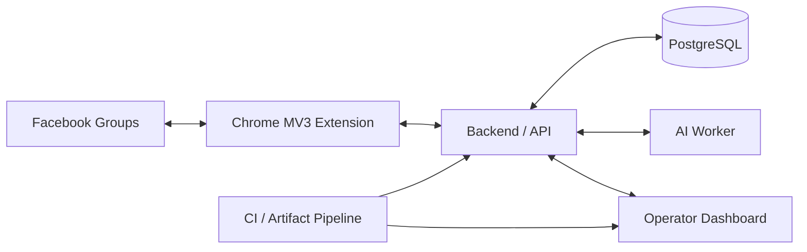

# FB Groups — AI Moderation & Market Intelligence Platform

> **Private operational system — architecture case study only. Source code, credentials, account identities, and sensitive runtime details are intentionally not published.**

## Overview

FB Groups is an operator-controlled Facebook-groups moderation and market-intelligence platform designed to combine browser automation, AI-assisted analysis, workflow state, and production operations without collapsing those concerns into one unsafe automation loop.

The system is intentionally split across browser, server, AI, dashboard, and persistence layers. That separation makes it possible to reason about what the software observed, what the policy engine decided, what the browser attempted, and what Facebook actually accepted as distinct pieces of evidence.

## My role

I worked across product architecture, browser-extension workflows, backend/API design, AI-worker integration, dashboard operations, PostgreSQL state, CI/CD, production safety, runtime verification, and manual acceptance boundaries.

## Architecture

## Engineering highlights

- Chrome Manifest V3 extension for bounded Facebook observation and reviewed execution transport.
- Backend/API layer for moderation state, market-source ingestion, policy decisions, and command lifecycle.
- Dedicated AI worker for analysis and decision-support workflows.
- Operator dashboard for command visibility, runtime health, and state review.
- PostgreSQL-backed persistent operational state.
- Explicit separation between source code, built extension, loaded browser runtime, server deployment, and Facebook-side acceptance.
- Fail-closed safety behavior when execution identity or runtime evidence is uncertain.
- Shared scheduling/exclusion boundaries to prevent competing automated Facebook work.
- Immutable-artifact CI/CD path with guarded production delivery and runtime-scope classification.
- Manual Facebook acceptance retained where external UI state is the real source of truth.

## Technology / system areas

| Area | Engineering focus |
|---|---|
| Browser automation | Chrome MV3, controlled observation, reviewed execution |
| Backend | API services, workflow state, policy boundaries |
| AI | Analysis worker, moderation/market-intelligence support |
| Data | PostgreSQL operational state |
| UI | Operator dashboard, command/runtime visibility |
| Delivery | CI/CD, immutable artifacts, guarded deploys, rollback thinking |
| Safety | Fail-closed execution, evidence separation, operator control |

## Engineering decisions

### Browser state is not server state

A successful server deployment cannot prove which extension build is loaded in Chrome, and a loaded extension cannot prove that Facebook accepted a UI action. The system treats each domain as independently verifiable.

### Automation must remain bounded

The browser layer never gets a blanket right to operate on Facebook. Automatic work is coordinated through explicit ownership, exclusion, pressure/safety checks, and operator-controlled acceptance boundaries.

### External-state claims need external evidence

CI, API status, and queue state are useful, but none of them are allowed to stand in for actual Facebook-side acceptance. This avoids reporting success when only an internal stage completed.

### Production delivery should be reproducible

Heavy verification and builds produce immutable artifacts. Production consumes the exact verified artifact rather than rebuilding ad hoc on the production host.

## What this project demonstrates

- AI-assisted workflow automation
- Browser-extension architecture
- Production-safe automation design
- Backend + AI + dashboard + database integration
- CI/CD and immutable-artifact delivery
- Operational safety and evidence-driven engineering
- Ability to design automation around unreliable external interfaces

---

**Source availability:** private for commercial, operational, security, and platform-safety reasons. This case study intentionally omits credentials, group/account identities, private infrastructure details, and proprietary automation logic.
