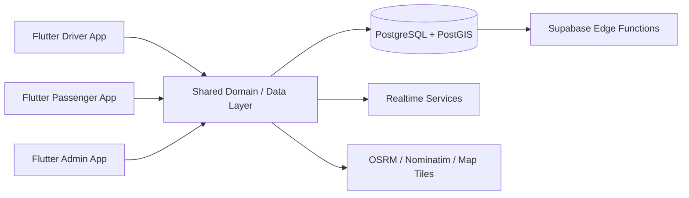

# Kovoyo — Shared Taxi Mobility Platform

> **Private product — architecture case study only. Source code is intentionally not public.**

## Overview

Kovoyo is a route-based shared-taxi platform with separate driver, passenger, and administration applications. Unlike ride-hailing, a published driver route remains authoritative: passengers join at suitable points along that route rather than causing the driver to detour.

That product rule drives the architecture. Matching, real-time state, geo queries, and mobile UX all have to preserve route integrity while still making the service feel immediate to both drivers and passengers.

## My role

I worked across product behavior, Flutter applications, shared domain packages, real-time data flows, geospatial backend design, route lifecycle behavior, production debugging, and mobile UX refinement.

## Architecture

## Engineering highlights

- Separate Flutter applications for driver, passenger, and admin workflows.
- Shared Dart packages for domain, data, realtime, geo, internationalization, UI, and testing concerns.
- PostgreSQL + PostGIS for route and geospatial data.
- Real-time driver/passenger state synchronization.
- Route publication and lifecycle rules designed around immutable published routes.
- Geospatial services integrating routing, search/geocoding, and map-tile infrastructure.
- Production debugging of route state, camera behavior, map UX, and driver/passenger lifecycle edge cases.
- Arabic-first mobile UX with operational behavior tuned for real devices rather than emulator-only assumptions.

## Technology

| Layer | Technology |
|---|---|
| Mobile | Flutter, Dart |
| Data | PostgreSQL, PostGIS, Supabase |
| Realtime | Supabase realtime/data flows |
| Geo | OSRM, Nominatim, PMTiles |
| Architecture | Shared Dart packages, domain-driven boundaries |
| Quality | Automated tests + physical-device verification |

## Engineering decisions

### The route is the product contract

Once a driver publishes a route, passenger matching is constrained by it. The system does not silently rewrite the driver's route to optimize pickups.

### Geospatial logic belongs below the UI

Matching and route behavior are treated as domain/data concerns rather than being embedded directly in map widgets. This keeps mobile presentation logic simpler and makes route rules easier to reason about and test.

### Physical-device behavior matters

Map camera behavior, overlays, lifecycle state, and interaction timing were validated on real Android hardware. This exposed production issues that were not visible from static code review alone.

## What this project demonstrates

- Production Flutter engineering
- Multi-application mobile architecture
- Realtime product state
- PostgreSQL/PostGIS and geospatial systems
- Complex lifecycle debugging
- Product-rule-driven architecture

---

**Source availability:** private for commercial and IP reasons. This case study intentionally excludes proprietary source code, credentials, private service configuration, and user data.
