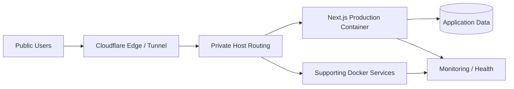

# Production Web Platform & Infrastructure

> **Private commercial infrastructure — architecture case study only. Sensitive runtime details are intentionally omitted.**

## Overview

This work covers a production web platform built and operated across application, container, routing, and service layers. The application side includes a Next.js customer platform; the infrastructure side focuses on reproducible containerized services, public HTTPS routing, health verification, and operational separation between development and production workloads.

The goal was not simply to deploy a website. It was to create an environment where multiple services could be operated, upgraded, observed, and recovered without turning the host machine into an undocumented collection of manual commands.

## My role

I worked across application delivery, Dockerized production services, Linux/WSL operations, Cloudflare routing, reverse-proxy patterns, service health, deployment workflow, and production troubleshooting.

## Architecture

## Engineering highlights

- Next.js App Router production application using React and TypeScript.
- Dockerized production runtime with development and production port separation.
- Cloudflare Tunnel used to expose services without directly publishing internal host ports.
- Multiple service workloads operated through Docker Compose.
- Health checks used to distinguish a running container from a healthy service.
- Server-side API foundations for customer-facing product capabilities.
- Background job patterns for asynchronous product workflows.
- Environment and secret boundaries kept outside source control.
- Operational documentation covering development, deployment, security, environment, and roadmap concerns.

## Technology

| Layer | Technology |
|---|---|
| Application | Next.js, React, TypeScript |
| Runtime | Docker, Docker Compose |
| Host | Linux / WSL |
| Edge / routing | Cloudflare Tunnel, reverse-proxy patterns |
| Delivery | Git-based deployment workflow |
| Operations | Health checks, monitoring, rollback-oriented practices |

## Engineering decisions

### Public access should not require public host exposure

Edge tunneling and internal routing keep application services behind controlled ingress rather than exposing arbitrary host ports directly to the internet.

### Development and production must not compete for the same runtime assumptions

Separate ports, explicit environment boundaries, and containerized production behavior reduce accidental coupling between active development and live workloads.

### Operational state needs documentation

Deployment commands, security constraints, environment expectations, and service responsibilities are documented so production behavior is reproducible rather than dependent on memory.

## What this project demonstrates

- Full-stack production ownership
- Docker and Linux operations
- Cloudflare-based edge routing
- Deployment and service-health thinking
- Application/infrastructure boundary design
- Ability to support software beyond the code-writing stage

---

**Source availability:** private for commercial, security, and IP reasons. This case study excludes credentials, host addresses, private service URLs, customer data, and proprietary operational configuration.
