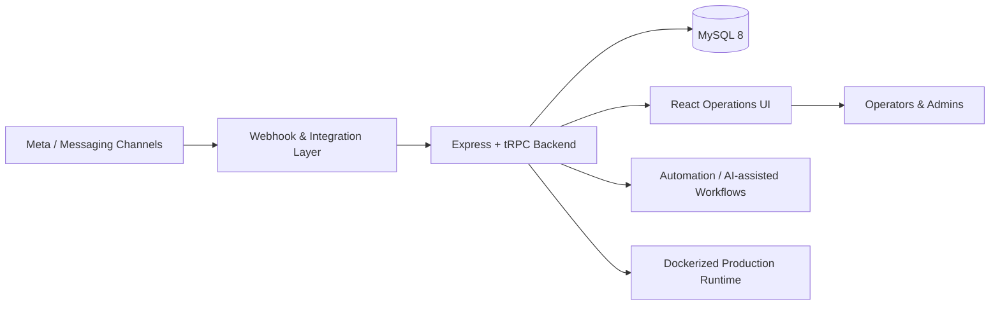

# Souketwensa CRM

> **Private commercial system — architecture case study only. Source code is intentionally not public.**

## Overview

Souketwensa CRM is a self-hosted, multi-tenant customer operations platform built around Meta messaging, customer management, lead workflows, and production-grade integrations.

The engineering challenge was not simply to build a dashboard. It was to create one operational system that could safely connect external messaging channels, persist customer and conversation state, isolate tenants, support internal workflows, and remain deployable and supportable in production.

## My role

I worked across the product end to end: application architecture, backend services, data modeling, platform integrations, operational workflows, deployment infrastructure, and production verification.

## Architecture

## Engineering highlights

- Multi-tenant architecture with tenant-aware data ownership and isolation.
- Self-hosted authentication and application sessions.
- Meta onboarding and webhook-driven messaging integration.
- Customer, conversation, lead, pipeline, filtering, and operational dashboard workflows.
- REST/tRPC application interfaces and integration boundaries designed around production use.
- Dockerized deployment with guarded release and health-verification practices.
- Production troubleshooting across UI, API, database, integration, and infrastructure layers.
- AI-assisted workflow capabilities layered on top of real operational customer data rather than isolated demos.

## Technology

| Layer | Technology |
|---|---|
| Frontend | React 19, Vite |
| Backend | Node.js, Express, tRPC |
| Data | MySQL 8, Drizzle ORM |
| Integrations | Meta APIs, webhooks, messaging workflows |
| Infrastructure | Docker, Linux, Cloudflare Tunnel |
| Delivery | Git-based workflow, guarded deployment verification |

## Engineering decisions

### Tenant isolation is a first-class concern

The platform uses a shared application and database model with explicit tenant ownership. Tenant context is part of the application boundary rather than an afterthought added at the UI layer.

### External integrations are treated as unreliable systems

Webhook and messaging flows are designed with persistence, state reconciliation, and production troubleshooting in mind. External API success is never assumed to be equivalent to complete business-state success.

### Deployment is part of the product

Production delivery includes explicit verification and rollback thinking. A successful build or HTTP response alone is not treated as sufficient evidence that the application is healthy.

## What this project demonstrates

- Full-stack product ownership
- API and webhook integration design
- Multi-tenant SaaS architecture
- CRM and customer-operations workflows
- Production deployment and incident thinking
- Ability to bridge business requirements and engineering systems

---

**Source availability:** private for commercial, security, and IP reasons. This case study intentionally contains no credentials, proprietary source code, customer data, or sensitive infrastructure details.
