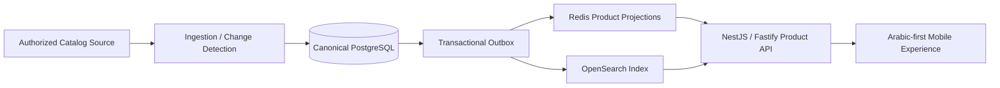

# Trendyol Syria — Arabic Commerce Platform

> **Private commercial system — architecture case study only. Source code is intentionally not public.**

## Overview

Trendyol Syria is an Arabic-first commerce platform designed around a mirrored product catalog and a purchasing workflow optimized for speed, data accuracy, and predictable customer reads.

The central engineering constraint is simple: customer traffic must never depend on live upstream marketplace latency. Catalog ingestion and customer serving therefore operate as separate planes with different performance and reliability requirements.

## My role

I designed and implemented the platform foundation around catalog ingestion, canonical product data, derived read models, search indexing, API delivery, and operational correctness.

## Architecture

## Engineering highlights

- Canonical PostgreSQL catalog model for authoritative product state.
- Field-level source-change detection before destructive updates.
- Transactional outbox to separate canonical writes from downstream projections.
- Versioned Redis product projections for fast read paths.
- Deterministic OpenSearch indexing for catalog discovery.
- NestJS/Fastify API layer optimized around precomputed customer reads.
- Separation of ingestion and serving planes so crawler/sync load cannot degrade customer traffic.
- Idempotent processing to make retries safe across products, offers, and operational events.
- Arabic-first / RTL-first product requirements with normalized searchable source data.
- Auditability designed into catalog mutations and operational transitions.

## Technology

| Layer | Technology |
|---|---|
| Canonical data | PostgreSQL |
| Backend | Node.js, NestJS, Fastify |
| Cache / projections | Redis |
| Search | OpenSearch |
| Reliability | Transactional outbox, idempotent processing |
| Client direction | Arabic-first mobile commerce |

## Engineering decisions

### Writes and reads have different jobs

The canonical database optimizes for correctness and traceability. Customer-facing reads are served from derived structures optimized for latency and search behavior.

### Upstream latency must not become product latency

Catalog synchronization is asynchronous and isolated from customer traffic. A slow or unavailable upstream source should affect freshness, not basic application responsiveness.

### Retry safety is architectural, not incidental

Ingestion and projection workflows are designed to tolerate retries without duplicating entities or creating inconsistent downstream state.

## What this project demonstrates

- Data-intensive platform architecture
- High-performance read modeling
- Search and cache design
- Event-driven reliability patterns
- Idempotent ingestion systems
- Arabic-first product engineering

---

**Source availability:** private for commercial and IP reasons. This case study intentionally excludes proprietary source code, source-access details, credentials, and private operational configuration.
